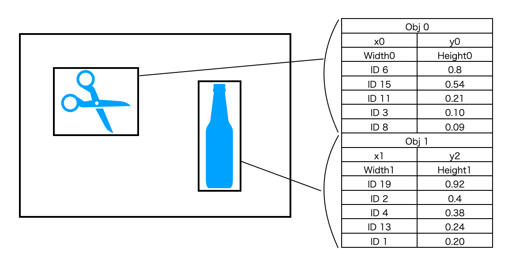

# find1000


<hr>

"find1000" is a python / Windows sample application for the USB high-speed streaming camera [INFINICAM UC-1](https://www.photron.co.jp/products/hsvcam/infinicam/) and its SDK with OpenCV.

In this SDK application we implement object recognition using the DNN (Deep Neural Network) module of OpenCV and YOLO, the object detection and recognition system (https://pjreddie.com/darknet/yolo/). The application will recognize objects such as people, cellphones and bottles faster than real-time. 

DNN is a heavy computation task and the core neural network processing and is relatively slow in comparison to Infinicam's capture speed. Unless we can achieve 1000 fps of processing, it might have no sense to use Infinicam as the capture device. However, a lightweight version of the YOLO is now approaching 200+ fps on modern GPU's. With the improvements in GPU processing the next few generations we will expect to see the need for 1000 fps processing for DNN applications. This sample allows you to understand how to use Infinicam for object detection using modern classification algorithms to achieve faster than real-time performance.

## What is find1000?
"find1000" is a simple python script that implements real-time classification. It captures images from the Infincam camera, analyzes them and displays the object it recognizes with rectangles overlaid on them together with a label of the detected object. 
### Starter
The inference operation in "find1000" starts by loading a DNN model from a series of files. The model in DNN consists of detailed image processing prescription, such as how an image is scaled, converted and convolved with what kind of parameters. The processing defined by the model eventually spawns a series of coefficients, which are then compared to the pre-learnt tables to derive the probability for registered objects.

The model used in "find1000" delivers the size and location of the object-surrounding rectangle and the probability array. "find1000" uses the result to draw rectangles with label of name of the recognized object. The name data is stored in another file, which is also loaded at the beginning of the program.

The following files are loaded at the beginning of the program.

 - yolov3.weights : Weight parameters for each NN layer
 - yolov3.cfg : The structure of the neural network
 - coco.names : Name labels for the recognized objects

```
	net = cv2.dnn.readNet("yolov3.weights", "yolov3.cfg")
	classes = []
	with open("coco.names", "r") as f:
		classes = [line.strip() for line in f.readlines()] 
```

The infinicam device can be opened in python code easily:
```
	cam = CameraFactory().create()
	decoder = cam.decoder()
```
### Main dish
The main processing of the inference comprises two steps:

 - Converting the image to a "blob"
 - Forward propagation

The blob is a form of data set that is processed as the inference target of the DNN processing. To effectively calculate the layer processing of the convolutional neural network, it has to follow some rules including scale, brightness gain, brightness offset, color component order, etc. In the "find1000" python script, for the YOLO model we use 160x160 resolution with no brightness-offsetting and change the brightness range from 0-255 to 0-1.0.

Forward propagation is the gathering of layered processes that actually multiply and add pixel values with pre-defined filters. Each layer has different roles such as feature enhancement, position adjustment, image normalization and deriving the feature vectors. It is the heaviest computation stage.
```
	blob = cv2.dnn.blobFromImage(img, scalefactor=0.00392, size=(160, 160), mean=(0, 0, 0), swapRB=True, crop=False)
	net.setInput(blob)
	outputs = net.forward(outputLayers)
```

The result of the above steps includes the x-y position and size of the detected objects and the id number table, which includes the possible inference object lists with its probability.



The infinicam capture and conversion from single channel mono to three channel image can be done as follows:
```
		xferData = cam.grab()
		frameMono = decoder.decode(xferData)
		height, width = frameMono.shape
		frame = cv2.merge((frameMono, frameMono, frameMono))
```
### Desert
Using the output of the propagation step, "find1000" draws the rectangles around the detected objects and label based on the highest probablilty result of the inference calculation.
```
	indexes = cv2.dnn.NMSBoxes(boxes, confs, 0.5, 0.4)
	for i in range(len(boxes)):
		if i in indexes:
			x, y, w, h = boxes[i]
			label = str(classes[class_ids[i]])
			cv2.rectangle(img, (x,y), (x+w, y+h), (255,0,255), 2)
			cv2.putText(img, label, (x, y - 5), cv2.FONT_HERSHEY_PLAIN, 1, (255,0,255), 1)
	cv2.imshow("Image", img)
```

## Environment
* installed Python 3.9

* Install Python PUCLIB
```
pip install pypuclib
```
* Install Python OpenCV
```
pip install opencv-python
```
## Build and execution
1. Download and install [PUCLIB](https://www.photron.co.jp/products/hsvcam/infinicam/tech.html) SDK.
2. Download DNN model
3. Clone this source code.
4. Execute [find1000.py](https://github.com/infinicam/find1000/master/find1000.py) .

```
python find1000.py
```

## Appendix: Fast Inference

As mentioned above, DNN inference process is very slow compared to the Infinicam high-speed capture. However, with this sample we can illustrate that you can achieve high-speed AI today even using python and today's commercially available processors.

You can use the CUDA library of OpenCV DNN running on a Nvidia card. Since the forward propagation step is made of huge numbers of multiply and addition, this type of processing is ideal to be accelerated by a GPU. The script already has a mechanism to implement an automatic backend switching mechanism to use a CUDA OpenCL backend if that is available.

You can also take advantage of a light weight model that can process faster at the expense of higher classifications errors. YOLO provides a simpler model called "yolov3-tiny", which has less layers resulting in a lower accuracy of recognition compared to 'yolo-v3'; however, it runs approximately 5 times faster.

In our experiment, we achieved 200+ fps using a CUDA backend running on a Nvidia 3070 GPU running with the yolov3-tiny model. This SDK application shows the benefits of using our high-speed camera for faster than real-time classification.

#### developed by: Photron Ltd.
